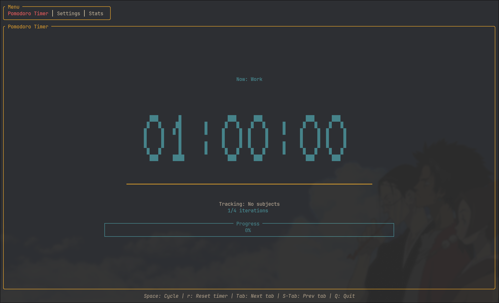
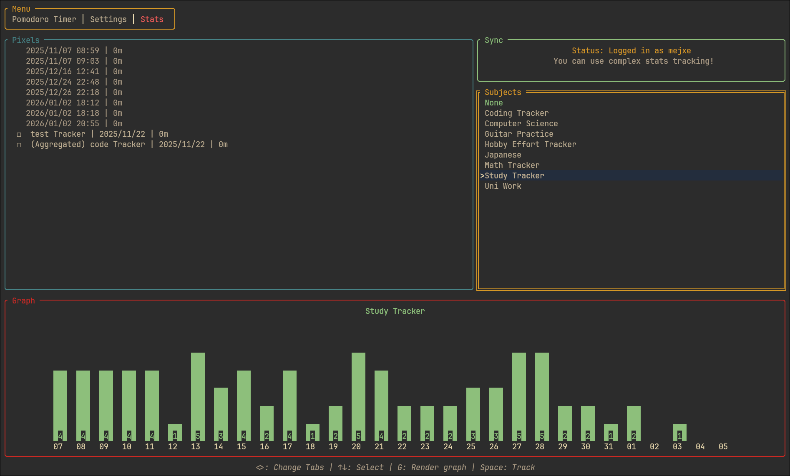
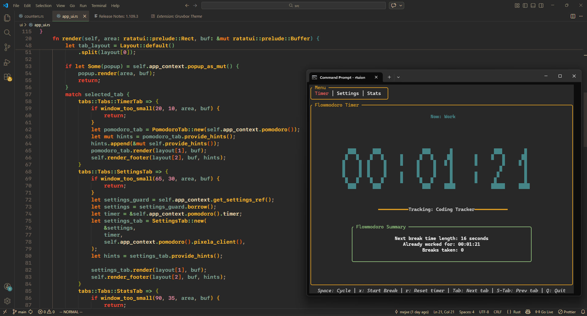

# rtuion - minimalist study companion
RTuion [ˈtujɔn] is a simple terminal interface timer with some extra features.
## Features
- Simple and clean interface
- Works in terminal
- Multiplatform
- Pomodoro timer
- Flowmodoro timer
- Simple Progress Tracking - log your study sessions
- Extended Progress Tracking - sync your study sessions with [pixe.la](https://pixe.la/)

## Installation
### Build manually
```
cargo install --git https://github.com/mejxe/rtuion.git
```

### Release
#### manual
This project uses cargo-dist for packing releases.
Simply check out the newest release and follow the steps there.

*I do not provide a macOS release since I can't test it, install with cargo at your own risk*

#### cargo binstall
Alternatively if you have cargo installed you can download it with cargo binstall
```
cargo binstall --git https://github.com/mejxe/rtuion.git
```

## Stats Tracking/Pixela Integration
RTuion makes it possible to log your study sessions. To use it to the full potential you will have to make a [pixe.la](https://pixe.la/) account.
The service is free (altough I encourage you to support pixe.la creator) and works great for tracking your progress.
#### Important
 To see your graph in rtuion it has to:
 - Have a unit of minutes or hours (or hrs, mins, Minutes, Hours)
 - Not have a unit of minutes and a type of float at the same time

If you do not wish to use remote stats tracking, you can use the simple mode that will log your study sessions locally (you still have to provide username in the settings!).

## Gallery





## Contributing
The project is not perfect, nor perfectly tested. If you find a bug or would like to suggeset a new feature, please submit an Issue.

## License
rtuion is licensed under MIT license.
